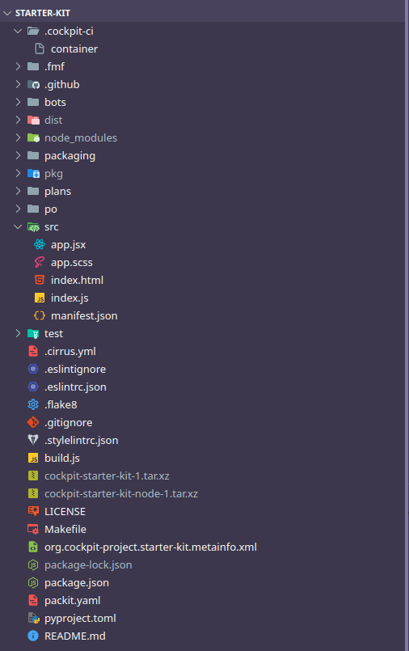

# Writing your first Cockpit application

Cockpit is a one to one web manager developed by Red Hat. It's designed to be highly extensible using applications. Applications are what the upstream Cockpit project calls plugins. They're written in JavaScript and use React with as the UI framework. To simplify the development process the upstream project uses [PatternFly](https://www.patternfly.org) as a React component library.

## Theory

### What is a component library or a component for that matter?

Seeing as many reading this are not JavaScript developers, I'll be going over some React concepts here. You can think of a React application as being built up on smaller components where each component can be thought of as a small building block running its own code and being more or less isolated from everything else. React components are written in JSX which is an extension of JavaScript that allows mixing HTML and JavaScript. A simple JSX element would be:

```jsx
const element = <h1>Hello, world!</h1>;
```

Initially it looks a bit weird (especially if you have written pure JavaScript and HTML) but as you write more JSX you'll feel more comfortable with writing it. Since components are just JavaScript we can export them from files and import them into others, allowing them to be reused across your project. PatternFly does exactly that, it provides components that we can reuse in our project. These components include CSS so we don't need to worry about styling our components. Instead we can just use the PatternFly ones.

### Understanding Cockpit internals.

Cockpit is made up of a few moving parts but from the perspective of an application developer, Cockpit is just a regular http/websocket server. While websockets can be diffcult to work with, Cockpit simplifies our approach with Cockpit.js since it handles the websocket management and message handling for us. Cockpit.js also allows us to interact with files (read, write, watch for changes), dbus apis, and run commands.

## Practice

### Getting ready to develop a Cockpit application

Before we can continue we need to get our system ready for developing a Cockpit application. I will assume you are running openSUSE Tumbleweed as the Cockpit.js api may be different in older versions of Cockpit. First we will need a nodejs runtime, the npm package manager, git, make, as well as cockpit itself. To install all of this we can use the opensuse repo. You may consider using nvm to manage nodejs versions if you prefer that method. I will assume if you are using nvm you know what to do, if not the following command will install all the required dependencies.

```sh
$ sudo zypper in nodejs npm git cockpit make
```

### Starter Kit, our best friend in Cockpit application development

Starter Kit is a repository on github that, provides all the boilerplate required to get started with Cockpit development. First lets fetch the repo using git:

```sh
$ git clone https://github.com/cockpit-project/starter-kit.git
```

Then we can `cd` into the directory and run `make`. This will handle downloading all the npm dependencies to the project directory.

```sh
$ cd starter-kit
$ make
```

If `make` ran succesfully, it means everything was setup correctly and you're now ready to start developing your first Cockpit Application!

From here we can open the folder in our preferred code editor. I will be using vscode, and screenshots will reflect the same. At this point we can take a look at the `src/` folder.




This is the first part, you can play around and try and figure out how things go from here or follow along in the second part.
