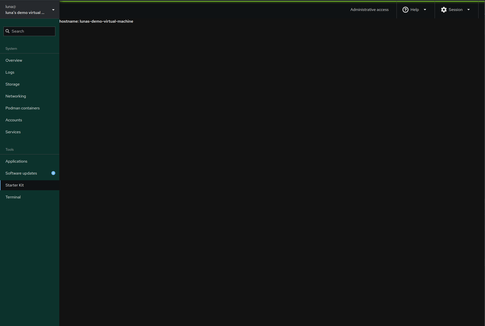

# Cockpit application development: The start

In the last part we downloaded the Starter Kit, installed our dependencies, and opened the repo in out code editor. Lets continue from there, we'll start by opening `src/app.jsx` where we can see the bare bones example application. As mentioned previously an Application is just the upstream jargon for plugins for Cockpit.

## Our first application
Right now it may seem daunting with a large amount of boilerplate, and support for translations via gettext. We're going to simplify this, first lets get rid of everything as we're going to start from scratch and build up. So lets start with a simple React component and import 2 libraries.

```js
import React from "react";
import cockpit from "cockpit";
```

The first line imports the React namespace allowing us to use goodies like `React.useEffect`/`React.useState` and secondly we import Cockpit, allowing us to use the Cockpit api. For now we are going to look into the React side. Looking into the [developer reference](https://react.dev/reference/react/useEffect) for useEffect the description is.

> `useEffect` is a React Hook that lets you synchronize a component with an external system.

While this may seem overly complicated it really is a component that is run when the page loads, and when one of its dependencies changes. It's useful for us as it will handle our application logic. Now lets look at `useState`, the description on the [developer reference](https://react.dev/reference/react/useState) is rather simple and less confusing.

> `useState` is a React Hook that lets you add a state variable to your component

`useState` is very simple, it allows us to create a state variable. Since normally variables in React components are not stateful, they will reset on every run. Having a state decouples the value of the variable from the render loop. Now using these 2 components we'll continue writing our code.

```jsx
export const Application = () => {
    const [hostname, setHostname] = React.useState("");

    React.useEffect(() => {
        /* application logic goes here */
    }, []);

    return <p>{`hostname: ${hostname}`}</p>;
};
```

`Application` defines a React component, all Cockpit applications have a main component called `Application`. Next we define a stateful variable `hostname` and a helper to set it `setHostname`. Finally we have a `useEffect` which runs our application code once the page renders. Now lets add our application logic:

```jsx
cockpit.spawn(["cat", "/etc/hostname"])
                .then(stdout => setHostname(stdout))
                .catch(() => setHostname("There was an error reading /etc/hostname"));
```

The logic is extremly simple. Here we are using the Cockpit api to spawn the command `cat /etc/hostname`. Then we take the output and use it to set the hostname state variable. If there was an error executing the Cockpit command we "handle" the error. Now our code should look like this.

```jsx
import React from "react";
import cockpit from "cockpit";

export const Application = () => {
    const [hostname, setHostname] = React.useState("");

    React.useEffect(() => {
        cockpit.spawn(["cat", "/etc/hostname"])
                .then(stdout => setHostname(stdout))
                .catch(() => setHostname("There was an error reading /etc/hostname"));
    }, []);

    return <p>{`hostname: ${hostname}`}</p>;
};
```

Now lets test out our code. To start with, lets build our application:

```sh
$ npm run build
```

This will build our application. Next let's install the application. Here we have two options. One is to install it with root privileges and make it available to all users or we can install without root privileges but only available to our the current user.

With root privileges:
```sh
$ make install
```

Without root privileges (recommended):
```sh
$ make devel-install
```

I would recommend using the non-root privileges option as it allows for faster development. After choosing your method and logging in with the appropriate user. You should see something similar to this page.

<sub>note: if you see no hostname check if /etc/hostname is empty, most recent versions of Tumbleweed do not set /etc/hostname and leave it as an empty file</sub>



So far we've been using JSX without any helpers. It looks extremely plain and borderline unusable. Before you continue if you'd like to learn more about React you can look into the further reading.

## Further reading:
- https://react.dev
