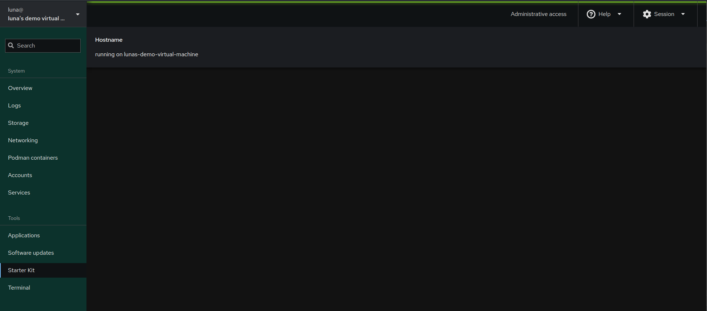

# PatternFly: how to make your application look better with minimal effort

Before we continue I'll be introducing what PatternFly is. PatternFly is a component library. We created a component when we defined `Application`.  Components are reusable bits of React code that allow us to simplify code. Lets look at a simple React component.

```jsx
function Greet({name}) {
    return <h1>`hello ${name}`</h1>
}
```

Here we have a simple component to say "hello ${name}" where name is provided. We can go a step futher and use it from another component.

```jsx

export function App() {
    return <Greet name="Luna" />
}
```
This essentially allows us to reuse components. We could go a step further than reusing it in a project and instead have a library of generic reusable components. That is what PatternFly is. This isn't the only component library, MaterialUi and ReactBootsrap. We'll now go back to the original code and import some components from `patternfly`.

```jsx
import { Card, CardTitle, CardBody } from '@patternfly/react-core';
```

This import a set of components `Card`, `Cardtitle` and `CardBody`. `Card` is a rectangular container that can contain any kind of content. A large amount of the dashboard is built using `Card`. Lets start modifying the component to use them. At the end of the `Application` component there is a return statement. We will change it to be:

```jsx
return (
        <Card>
            <CardTitle>Hostname</CardTitle>
            <CardBody>running on {hostname}</CardBody>
        </Card>
    );
```

When we deal with JSX we work with JavaScript inside of the html using `{}` in the previous return statement ```return <p>{`hostname: ${hostname}`}</p>;``` we used `${}` as we were dealing with a template string. Lets take a look at what the component will look like now. If you used the `make devel-install` command you will only need to run `npm run build`.




So now we've covered the basics of PatternFly, lets play a little with the Cockpit api before we end this section. Continuing where we left off earlier with the following:

```jsx
import React from "react";
import cockpit from "cockpit";
import { Card, CardTitle, CardBody } from "@patternfly/react-core";

export const Application = () => {
    const [hostname, setHostname] = React.useState("");

    React.useEffect(() => {
        cockpit.spawn(["cat", "/etc/hostname"])
                .then(stdout => setHostname(stdout))
                .catch(() => setHostname("There was an error reading /etc/hostname"));
    }, []);

    return <p>{`hostname: ${hostname}`}</p>;
};
```

Currently we are using `cat` to read the file which creates a implicity dependency on coreutils, and will never change if our hostname changes. Cockpit provides an api for interacting with files doing the basics of read, write and watch as well as some more complex functionaly like atomic modifications. For this we're going to make use of the watch functionality, replace the code inside `useEffect` with:

```jsx
cockpit.file("/etc/hostname")
    .watch((content) => {
        if (content) {
            setHostname(content);
        }
    });
```

Now, we use Cockpits internal api to read the file and watch for changes. The benefit to this approach is we have no external dependencies. We now get the content of `/etc/hostname` as it changes amongst many other benefits. Next lets look into the more advanced uses of the Cockpit api, and make a "better" hostname application. At this point your code should look like:

```jsx
import React from "react";
import cockpit from "cockpit";
import { Card, CardTitle, CardBody } from "@patternfly/react-core";

export const Application = () => {
    const [hostname, setHostname] = React.useState("");

    React.useEffect(() => {
       cockpit.file("/etc/hostname")
            .watch((content) => {
                if (content) {
                    setHostname(content);
                }
            });
    }, []);

    return (
        <Card>
            <CardTitle>Hostname</CardTitle>
            <CardBody>running on {hostname}</CardBody>
        </Card>
    );
};
```
