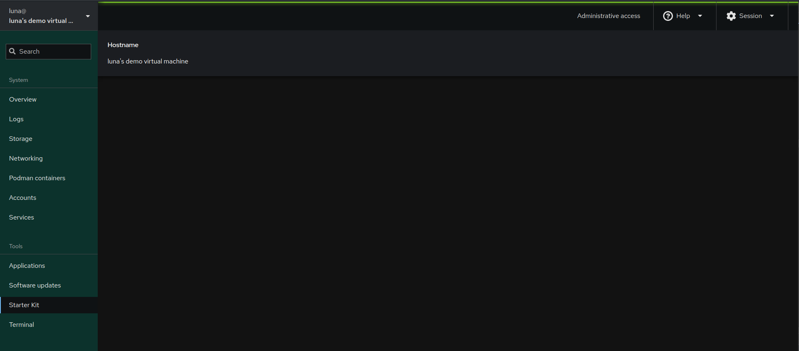

# Advanced cockpit

So far our application has grown from a just a string on the page to now a more fleshed out semi passable view. Lets go a step further and make it more useful, currently we are reading our data from `/etc/hostname` however that isn't guaranteed to have data nor is it guaranteed to be the actual hostname on a system using systemd. Lets decouple ourselves from files and instead switch to dbus and use that to get a little more information.

So systemd offers a dbus api `org.freedesktop.hostname1` which returns a nice json object with a lot of system information. Getting and displaying this will be a little more involved than other parts. We'll be breaking this into 2 parts, in the first we'll simply change our data source to the dbus api and use the "pretty host name" instead of the `/etc/hostname`. At this point your code should look like:


```jsx
import React from "react";
import cockpit from "cockpit";
import { Card, CardTitle, CardBody } from "@patternfly/react-core";

export const Application = () => {
    const [hostname, setHostname] = React.useState("");

    React.useEffect(() => {
       cockpit.file("/etc/hostname")
            .watch((content) => {
                if (content) {
                    setHostname(content);
                }
            });
    }, []);

    return (
        <Card>
            <CardTitle>Hostname</CardTitle>
            <CardBody>running on {hostname}</CardBody>
        </Card>
    );
};
```

Lets start with replacing the `cockpit.file` api with some code to work with the dbus api. Before we continue I want to just state this is a extemely small glance at the dbus api, we are using the very basics here.

```jsx
const client = cockpit.dbus("org.freedesktop.hostname1");
client.call("/org/freedesktop/hostname1", "org.freedesktop.hostname1", "Describe").then(([data]) => {
                    setHostname(JSON.parse(data).PrettyHostname);
                });
```

We start by creating a dbus client and specifying the `org.freedesktop.hostname1` interface. Next we use the `client.call` function as it greatly simplfies our work, since we don't intend to reuse the `proxy`. This saves a large amount of work creating dbus `proxies` however this does mean we can't use interactive api's with `.call`. Since `.call` returns a promise we have to wait for the data to return.

You might have already noticed data is in an array. All data returned by `.call` returns the data in an array, hence we use `[data]` to access the data instead the array without manually accessing the data. Next we use `JSON.parse(data)` to convert the returned string to an object/array since `org.freedesktop.hostname1.Describe` returns json data. We then access the `PrettyHostname` key and set the hostname. In the end our page should look like this now:



While your code should look like this now:

```jsx
import React from "react";
import cockpit from "cockpit";
import { Card, CardTitle, CardBody } from "@patternfly/react-core";

export const Application = () => {
    const [hostname, setHostname] = React.useState("");

    React.useEffect(() => {
       const client = cockpit.dbus("org.freedesktop.hostname1");
       client.call("/org/freedesktop/hostname1", "org.freedesktop.hostname1", "Describe")
       .then(([data]) => {
                    setHostname(JSON.parse(data).PrettyHostname);
        });
    }, []);

    return (
        <Card>
            <CardTitle>Hostname</CardTitle>
            <CardBody>running on {hostname}</CardBody>
        </Card>
    );
};
```

In the next part we will be using more of this data and play a little more with PatternFly.
