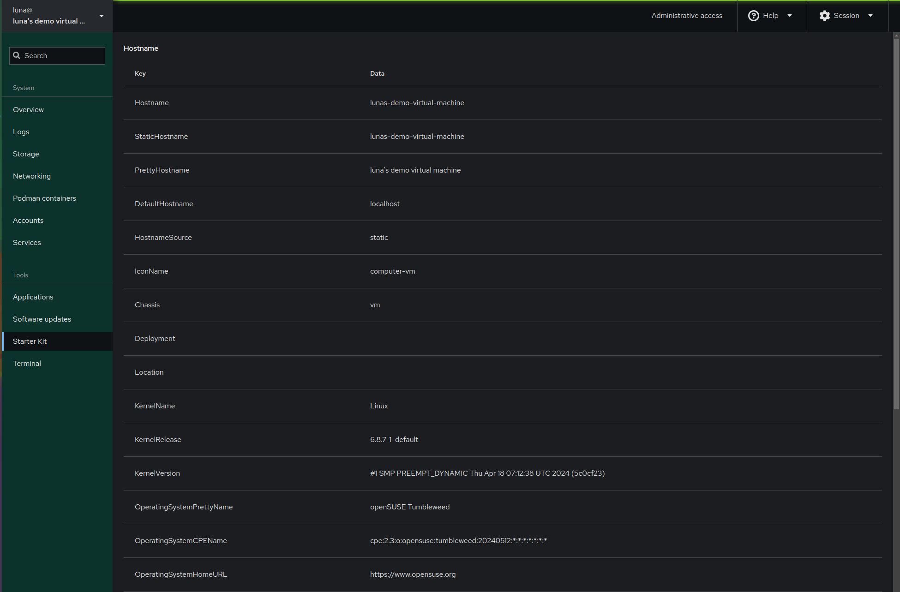

# More interesting PatternFly usage

At this point we have a simple Cockpit application that through its incarnations has touched most of Cockpit's major api components and in the last part we switched to the dbus api. In this part we'll be playing with more of PatternFly and we'll also be able to learn some more JSX functionality.

Before we continue we need to add a JavaScript dependency. `Table` in PatternFly is part of a separate package so we'll need to add the [`@patternfly/react-table`](https://www.npmjs.com/package/@patternfly/react-table) package.

```
$ npm add @patternfly/react-table
```

Lets start by adding to the imports with a new set of imports from our newly added package.

```jsx
import { Table, Thead, Tbody, Tr, Th, Td } from '@patternfly/react-table';
```

Now we need to change our state variable. We need to go from `""` to `{}` this changes the React variable to a empty object reflecting the fact we'll be working with a JavaScript object. We'll also change out effect to set the object instead of just the `PrettyHostname` key. so our code now looks like.

```jsx
const [hostname, setHostname] = React.useState({});

React.useEffect(() => {
        const client = cockpit.dbus("org.freedesktop.hostname1");
        client.call("/org/freedesktop/hostname1", "org.freedesktop.hostname1", "Describe")
                .then(([data]) => {
                    setHostname(JSON.parse(data));
                });
    }, []);
```

Before we look at the rest of the code lets take a quick peak at the `JSON` data returned by the dbus data:

```json
{
    "Hostname":"lunas-demo-virtual-machine",
    "StaticHostname":"lunas-demo-virtual-machine",
    "PrettyHostname":"luna's demo virtual machine",
    "DefaultHostname":"localhost",
    "HostnameSource":"static",
    ...
}
```
This is an abridge version that lets us take a look at some of the more interesting parts like `PrettyHostname`. After this we'll add some code to display the new data. We can start by removing the old return block and checking if `hostname` is actually set.

```jsx
if (Object.keys(hostname).length !== 0) {
    /* handle data here */
}else {
    return (
        <Card>
            <CardTitle>Hostname</CardTitle>
            <CardBody>Fetching data</CardBody>
        </Card>
    );
}
```

You might have noticed something really funky, we check if hostname is set using `Object.keys(hostname).length !== 0`. This is due to a quirk of JavaScript, objects are only checked in types and not value (yes I hate this too). Instead we have to use this workaround. We'll now look at how we need to handle the data.

```jsx
return (
        <Card>
            <CardTitle>Hostname</CardTitle>
            <CardBody>
                <Table>
                    <Thead>
                        <Tr>
                            <Th>Key</Th>
                            <Th>Data</Th>
                        </Tr>
                    </Thead>
                    <Tbody>
                        /* logic to display key value pairs */
                    </Tbody>
                </Table>
            </CardBody>
        </Card>
    );
```

This is pretty much boilerplate, it just instantiates a table. The most interesting part is yet to come, inside the `<Tbody>` We need to add logic to handle the the display of the data recived from the dbus api:

```jsx
{
    Object.keys(hostname).map((key) => (
        <Tr key={key}>
            <Td>{key}</Td>
            <Td>{hostname[key]}</Td>
        </Tr>
    ))
}
```

If you recall in JSX `{}` is used to inject JavaScript. So here the outermost curly brackets allow us to run some JavaScript. We access the keys of the object stored in `hostname`. Then the `map` function allows us to map array values to new objects and return an array in the end.

You might have noticed `key={key}`, when we deal with array's of React components we use `key` value to keep track of components. In the end we display a table with the keys and value of each part of the hostname object. Putting everything together our code should look like:

```jsx
import cockpit from 'cockpit';
import React from 'react';
import { Card, CardTitle, CardBody } from '@patternfly/react-core';
import { Table, Thead, Tbody, Tr, Th, Td } from '@patternfly/react-table';

export const Application = () => {
    const [hostname, setHostname] = React.useState({});

    React.useEffect(() => {
        const client = cockpit.dbus("org.freedesktop.hostname1");
        client.call("/org/freedesktop/hostname1", "org.freedesktop.hostname1", "Describe")
                .then(([data]) => {
                    setHostname(JSON.parse(data));
                });
    }, []);

    if (Object.keys(hostname).length !== 0) {
        return (
            <Card>
                <CardTitle>Hostname</CardTitle>
                <CardBody>
                    <Table>
                        <Thead>
                            <Tr>
                                <Th>Key</Th>
                                <Th>Data</Th>
                            </Tr>
                        </Thead>
                        <Tbody>
                            {
                                Object.keys(hostname).map((key) => (
                                    <Tr key={key}>
                                        <Td>{key}</Td>
                                        <Td>{hostname[key]}</Td>
                                    </Tr>
                                ))
                            }
                        </Tbody>
                    </Table>
                </CardBody>
            </Card>
        );
    } else {
        return (
            <Card>
                <CardTitle>Hostname</CardTitle>
                <CardBody>Fetching data</CardBody>
            </Card>
        );
    }
};
```

Finally building and installing the update application we get a page like:



You've reached the end of the code, section. The next and final part will be where to go from here.
